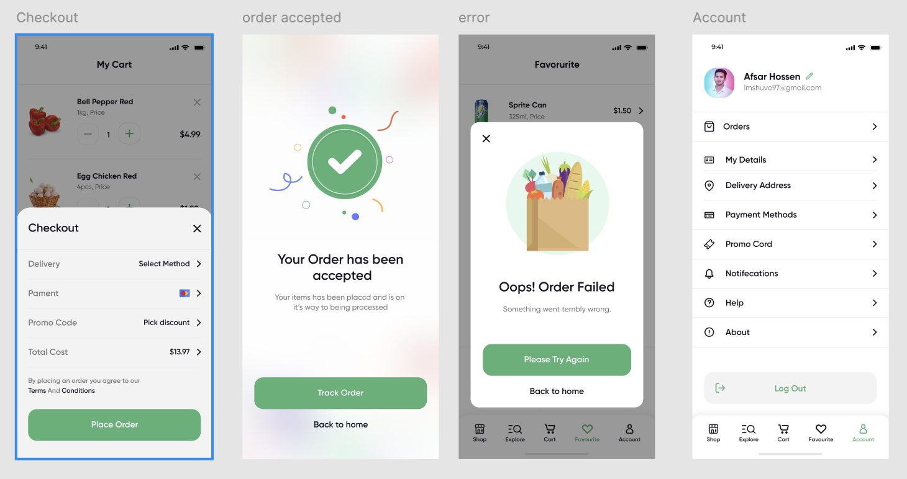
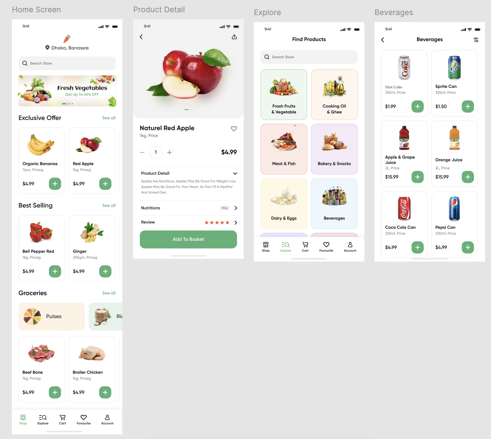
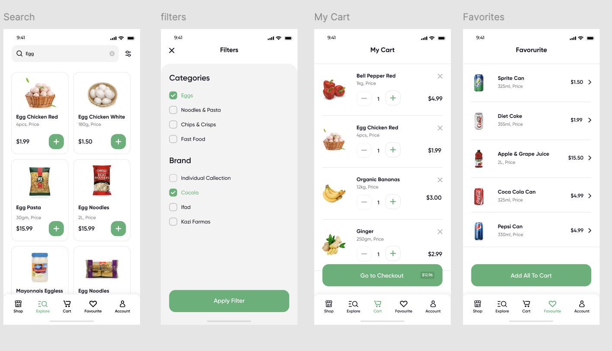
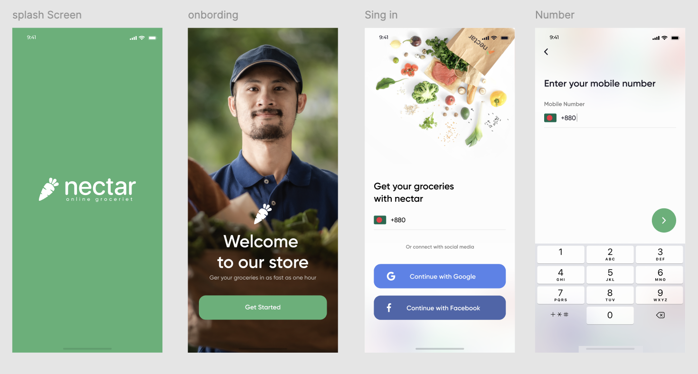
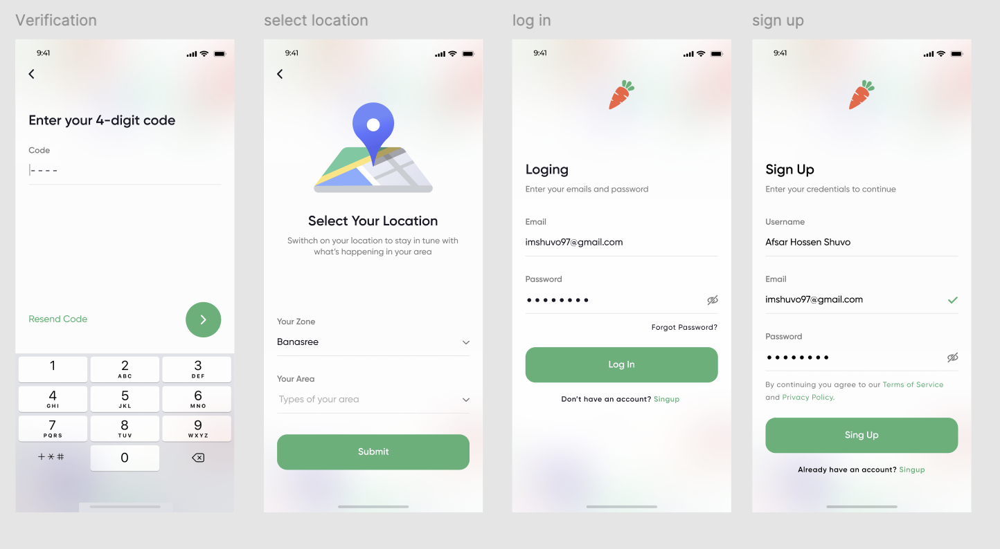

# 🛒 Online Grocery Store App

A modern Flutter application built with **Clean Architecture** principles, featuring multi-environment support, robust state management, and comprehensive logging capabilities.

## 📋 Table of Contents

- [🎯 Project Overview](#-project-overview)
- [🏗️ Architecture](#️-architecture)
- [📁 Project Structure](#-project-structure)
- [🛠️ Tech Stack](#️-tech-stack)
- [🚀 Getting Started](#-getting-started)
- [🌍 Multi-Environment Setup](#-multi-environment-setup)
- [📱 Features](#-features)
- [🧪 Testing](#-testing)
- [📚 Documentation](#-documentation)
- [🤝 Contributing](#-contributing)

## 🎯 Project Overview

This Online Grocery Store App is a production-ready Flutter application that demonstrates best practices in mobile app development. Built with **Clean Architecture**, it provides a scalable, maintainable, and testable codebase suitable for enterprise-level applications.

## 📸 Screenshots

<p align="center">
  
  
  
  
  
</p>

### Key Highlights

- ✅ **Clean Architecture** with proper layer separation
- ✅ **Multi-environment support** (Development, Staging, Production)
- ✅ **Robust error handling** with Result pattern
- ✅ **Comprehensive logging** system
- ✅ **Dependency Injection** with GetIt and Injectable
- ✅ **State Management** with BLoC pattern
- ✅ **Secure storage** for sensitive data
- ✅ **Internationalization** support
- ✅ **Code generation** for models and DI

## 🏗️ Architecture

This project follows **Clean Architecture** principles with clear separation of concerns:

```
┌─────────────────────────────────────────────────────────┐
│                    Presentation Layer                    │
│  • UI Components (Screens, Widgets)                    │
│  • State Management (BLoC/Cubit)                       │
│  • Routes & Navigation                                  │
└─────────────────────┬───────────────────────────────────┘
                      │
┌─────────────────────▼───────────────────────────────────┐
│                     Domain Layer                        │
│  • Business Logic (Use Cases)                          │
│  • Entities & Value Objects                            │
│  • Repository Interfaces                               │
│  • Core Abstractions                                   │
└─────────────────────┬───────────────────────────────────┘
                      │
┌─────────────────────▼───────────────────────────────────┐
│                      Data Layer                         │
│  • Repository Implementations                           │
│  • Data Sources (Remote API, Local Storage)            │
│  • Models & Mappers                                     │
│  • External Service Integrations                       │
└─────────────────────────────────────────────────────────┘
```

### Architecture Benefits

- **🔄 Testability**: Easy to mock dependencies and test business logic
- **🔧 Maintainability**: Clear separation of concerns makes code easy to maintain
- **📈 Scalability**: Easy to add new features without affecting existing code
- **🔀 Flexibility**: Easy to swap implementations (e.g., different storage mechanisms)
- **🎯 Domain Independence**: Business logic is not coupled to external frameworks

## 📁 Project Structure

```
lib/
├── 📱 app.dart                          # Main app configuration
├── 🌐 main_dev.dart                     # Development entry point
├── 🌐 main_staging.dart                 # Staging entry point
├── 🌐 main_prod.dart                    # Production entry point
├── 
├── 🏛️ core/                             # Shared utilities and configurations
│   ├── 📦 assets_gen/                   # Generated asset classes
│   ├── 📋 constants/                    # App constants and keys
│   ├── 🎨 enums/                        # Application enums
│   ├── 🌍 env/                          # Environment configurations
│   ├── 🔧 extensions/                   # Dart extensions
│   ├── 📝 logging/                      # Logging implementations
│   └── 🛠️ utils/                        # Utility functions
│
├── 🎯 domain/                           # Business logic layer (Pure Dart)
│   ├── 🏛️ core/                         # Domain core abstractions
│   │   ├── app_logger.dart             # Logger interface
│   │   ├── failures.dart               # Error types
│   │   ├── result.dart                 # Result type definitions
│   │   └── usecase.dart                # Use case base classes
│   ├── 📊 entities/                     # Business entities
│   ├── 📁 repositories/                 # Repository interfaces
│   ├── ⚙️ usecase/                      # Business use cases
│   └── 💎 value_object/                 # Domain value objects
│
├── 💾 data/                             # Data access layer
│   ├── 🏛️ core/                         # Data layer utilities
│   │   ├── dio_failure_mapper.dart     # Error mapping
│   │   ├── exceptions.dart             # Custom exceptions
│   │   ├── guard.dart                  # Error handling guards
│   │   └── interceptors.dart           # HTTP interceptors
│   ├── 🔌 datasources/                  # Data source implementations
│   │   ├── local/                      # Local storage (SharedPrefs, SecureStorage)
│   │   └── remote/                     # Remote API (Retrofit, Dio)
│   ├── 🔄 mappers/                      # Data transformation
│   ├── 📋 models/                       # Data transfer objects
│   └── 📁 repositories/                 # Repository implementations
│
├── 🎨 presentation/                     # UI layer
│   ├── 🧠 bloc/                         # State management (BLoC/Cubit)
│   ├── ❌ error/                        # Error handling UI
│   ├── 🛣️ routes/                       # Navigation & routing
│   ├── 📱 screens/                      # UI screens
│   ├── 🔄 shared/                       # Reusable UI components
│   └── 🎨 theme/                        # App theming
│
├── 💉 di/                               # Dependency injection
│   ├── domain_module.dart              # Domain layer DI
│   ├── env_module.dart                 # Environment DI
│   ├── injector.dart                   # DI configuration
│   ├── injector.config.dart            # Generated DI code
│   └── third_party_module.dart         # External dependencies DI
│
└── 🌍 l10n/                             # Internationalization
    ├── app_localizations.dart          # Generated localizations
    ├── app_en.arb                      # English translations
    └── app_vi.arb                      # Vietnamese translations
```

### Layer Responsibilities

#### 🎯 Domain Layer (Pure Business Logic)
- **Entities**: Core business objects
- **Use Cases**: Business operations and rules
- **Repository Interfaces**: Data access contracts
- **Value Objects**: Domain-specific data types
- **Core**: Domain-level utilities and abstractions

#### 💾 Data Layer (Data Access & External Services)
- **Repositories**: Implement domain repository interfaces
- **Data Sources**: Handle external data (API, Database, Storage)
- **Models**: Data transfer objects with serialization
- **Mappers**: Convert between models and entities
- **Core**: Data layer utilities and error handling

#### 🎨 Presentation Layer (UI & User Interaction)
- **Screens**: UI pages and layouts
- **BLoC/Cubit**: State management and business logic coordination
- **Routes**: Navigation configuration
- **Shared**: Reusable UI components
- **Theme**: UI styling and theming

#### 💉 Dependency Injection
- **Modules**: Organize dependency registration by concern
- **Configuration**: Setup and initialization
- **Generated Code**: Auto-generated dependency graph

## 🛠️ Tech Stack

### Core Framework
- **Flutter 3.8.1+** - Cross-platform mobile framework
- **Dart 3.8.1+** - Programming language

### Architecture & State Management
- **flutter_bloc ^9.0.0** - State management with BLoC pattern
- **get_it ^8.0.1** - Service locator for dependency injection
- **injectable ^2.5.0** - Code generation for dependency injection
- **equatable ^2.0.7** - Value equality for Dart objects

### Networking & API
- **dio ^5.7.0** - HTTP client for API calls
- **retrofit ^4.4.1** - Type-safe HTTP client generator
- **pretty_dio_logger ^1.4.0** - HTTP request/response logging

### Data & Storage
- **shared_preferences ^2.3.3** - Simple key-value storage
- **flutter_secure_storage ^9.2.3** - Secure storage for sensitive data
- **json_annotation ^4.9.0** - JSON serialization annotations

### Error Handling & Utilities
- **dartz ^0.10.1** - Functional programming (Either, Option)
- **freezed ^2.5.8** - Code generation for immutable classes
- **logger ^2.5.0** - Logging framework

### UI & User Experience
- **flutter_screenutil ^5.9.3** - Screen adaptation for different sizes
- **cached_network_image ^3.4.1** - Image caching and loading
- **flutter_svg ^2.1.0** - SVG image support
- **go_router ^15.0.0** - Declarative routing

### Internationalization
- **flutter_localizations** - Flutter's built-in localization
- **intl ^0.20.2** - Internationalization utilities

### Development Tools
- **build_runner ^2.4.14** - Code generation runner
- **flutter_gen_runner ^5.11.0** - Asset code generation
- **flutter_lints ^5.0.0** - Dart linting rules

## 🚀 Getting Started

### Prerequisites

- **Flutter SDK**: 3.8.1 or higher
- **Dart SDK**: 3.8.1 or higher
- **IDE**: VS Code, Android Studio, or IntelliJ IDEA
- **Git**: For version control

### Installation

1. **Clone the repository**
   ```bash
   git clone <repository-url>
   cd Online-Grocery-App-Flutter
   ```

2. **Install dependencies**
   ```bash
   flutter pub get
   ```

3. **Generate code**
   ```bash
   dart run build_runner build --delete-conflicting-outputs
   ```

4. **Run the app**
   ```bash
   # Development environment
   flutter run --flavor dev -t lib/main_dev.dart
   
   # Staging environment
   flutter run --flavor staging -t lib/main_staging.dart
   
   # Production environment
   flutter run --flavor prod -t lib/main_prod.dart
   ```

## 🌍 Multi-Environment Setup

This project supports three environments with different configurations:

### 🔧 Development Environment
- **Entry Point**: `lib/main_dev.dart`
- **Base URL**: `https://dummyjson.com`
- **Debug Features**: Enabled
- **Logging**: Verbose

### 🧪 Staging Environment
- **Entry Point**: `lib/main_staging.dart`
- **Base URL**: `https://dummyjson.staging.com`
- **Debug Features**: Limited
- **Logging**: Info level

### 🚀 Production Environment
- **Entry Point**: `lib/main_prod.dart`
- **Base URL**: `https://dummyjson.prod.com`
- **Debug Features**: Disabled
- **Logging**: Error level only

### VS Code Launch Configuration

The project includes VS Code launch configurations in `.vscode/launch.json`:

```json
{
  "configurations": [
    {
      "name": "Development",
      "program": "lib/main_dev.dart",
      "args": ["--flavor", "dev"]
    },
    {
      "name": "Staging", 
      "program": "lib/main_staging.dart",
      "args": ["--flavor", "staging"]
    },
    {
      "name": "Production",
      "program": "lib/main_prod.dart", 
      "args": ["--flavor", "prod"]
    }
  ]
}
```

## 📱 Features

### 🔐 Authentication System
- **Secure Login**: Username/password authentication
- **Token Management**: Automatic token storage and refresh
- **Session Persistence**: Remember user sessions

### 🏪 Grocery Shopping
- **Product Catalog**: Browse available products
- **Shopping Cart**: Add/remove items
- **Order Management**: Place and track orders

### 🎨 User Experience
- **Responsive Design**: Adapts to different screen sizes
- **Dark/Light Theme**: Theme switching capability
- **Internationalization**: Multi-language support
- **Offline Support**: Basic offline functionality

### 🔧 Technical Features
- **Error Handling**: Comprehensive error management
- **Logging**: Detailed application logging
- **Caching**: Efficient data and image caching
- **Security**: Secure storage for sensitive data

## 🧪 Testing

### Running Tests

```bash
# Run all tests
flutter test

# Run tests with coverage
flutter test --coverage

# Run integration tests
flutter drive --target=test_driver/app.dart
```

### Test Structure

```
test/
├── unit/                    # Unit tests
│   ├── domain/             # Domain layer tests
│   ├── data/               # Data layer tests
│   └── presentation/       # Presentation layer tests
├── widget/                 # Widget tests
├── integration/            # Integration tests
└── mocks/                  # Mock objects
```

### Testing Strategy

- **Unit Tests**: Test business logic and data transformations
- **Widget Tests**: Test UI components and user interactions
- **Integration Tests**: Test complete user flows
- **Mock Objects**: Use for external dependencies

## 📚 Documentation

### Additional Documentation

- **[Tech Stack Details](TECH_STACK.md)** - Comprehensive tech stack documentation
- **[Setup Guide](SETUP_GUIDE.md)** - Detailed setup and usage instructions
- **[Clean Architecture Guide](CLEAN_ARCHITECTURE.md)** - Architecture principles and patterns
- **[Vietnamese Documentation](README_VI.md)** - Vietnamese version of this README

### Code Documentation

The codebase includes comprehensive inline documentation:

- **Class Documentation**: Every class has detailed documentation
- **Method Documentation**: Public methods include usage examples
- **Architecture Decision Records**: Document important architectural decisions

## 🤝 Contributing

### Development Workflow

1. **Fork the repository**
2. **Create a feature branch**: `git checkout -b feature/amazing-feature`
3. **Follow coding standards**: Use the provided linting rules
4. **Write tests**: Ensure good test coverage
5. **Commit changes**: `git commit -m 'Add amazing feature'`
6. **Push to branch**: `git push origin feature/amazing-feature`
7. **Open a Pull Request**

### Coding Standards

- **Follow Dart/Flutter conventions**
- **Use meaningful variable and function names**
- **Write comprehensive tests**
- **Document public APIs**
- **Follow Clean Architecture principles**

### Code Review Checklist

- [ ] Code follows project architecture
- [ ] Tests are included and passing
- [ ] Documentation is updated
- [ ] No linting errors
- [ ] Performance considerations addressed

## 📄 License

This project is licensed under the MIT License - see the [LICENSE](LICENSE) file for details.

## 👥 Team

- **Lead Developer**: [Your Name]
- **Architecture**: Clean Architecture with SOLID principles
- **State Management**: BLoC pattern
- **Backend Integration**: RESTful APIs

## 🙏 Acknowledgments

- **Flutter Team** - For the amazing framework
- **Community Packages** - For the excellent third-party packages
- **Clean Architecture** - Robert C. Martin's architectural principles
- **BLoC Pattern** - Felix Angelov and the BLoC library team

---

**Happy Coding! 🚀**

For more information, please refer to the additional documentation files or open an issue in the repository.